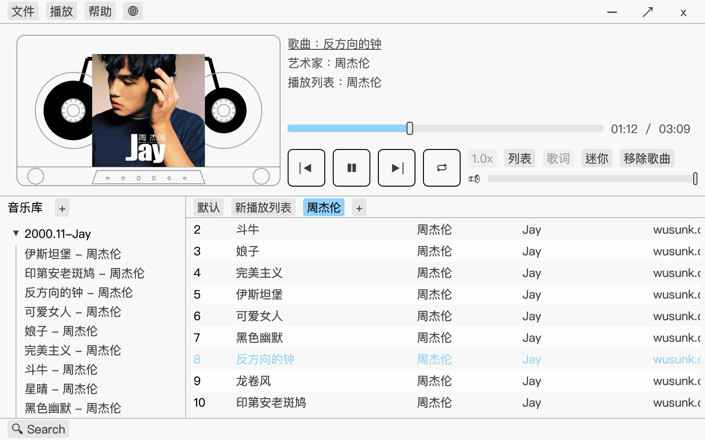

# Bird Player

A MP3 music player built with [egui](https://github.com/emilk/egui) and Rust, featuring a nostalgic 2000s-inspired interface. Bird Player is originally forked from [music-player](https://github.com/notryanb/music-player) by [notryanb](https://github.com/notryanb) and try to make it a serious daily-used music player. If you miss the golden era of desktop music players, this might be for you!

<div style="display: flex; width: 100%;">
    
    
</div>

> [!Warning]
> This project is still under active development and some features are not yet available. You may need to rebuild your playlist and library after the upgrade.

## Features

- 🎨 Retro-inspired UI built with egui, reminiscent of classic 2000s music players
- 📁 Local music library and playlist management with familiar browsing experience
- 🏷️ ID3 tag management and editing support for music metadata
- 📱 Cross-platform support

## TODO

- [ ] Improve the resource usage and make it small and fast
- [ ] Add support for more audio formats
- [ ] Add support for batch tag editing
- [ ] Add support for lyrics searching and displaying
- [ ] Add support for speed control
- [ ] Implement a skin system

## Installation

### Prerequisites

- Rust 1.70 or higher
- Cargo package manager
- Audio system libraries (see [Audio Backends](#audio-backends) below)

### Building from Source

1. Clone the repository:
```bash
git clone https://github.com/yourusername/bird-player.git
cd bird-player
```

2. Build the project:
```bash
# With PulseAudio support (recommended for Linux)
cargo build --release --features pulseaudio

# Without PulseAudio (using CPAL directly)
cargo build --release
```

The compiled binary will be available in `target/release/bird-player`.

## Audio Backends

Bird Player supports different audio backends depending on your platform:

- **Linux:** PulseAudio (recommended) or CPAL with ALSA
- **macOS:** CoreAudio via CPAL
- **Windows:** Windows Audio Session API via CPAL

For detailed dependency requirements and troubleshooting, see [AUDIO_BACKENDS.md](AUDIO_BACKENDS.md).

## Usage

1. Launch Bird Player:
```bash
cargo run --release
```

2. Use the file dialog to add your music directory
3. Browse and play your music collection
4. Enjoy your music with high-quality audio playback

## Configuration

Bird Player automatically saves your configuration and library state between sessions. The configuration file is stored in the standard system configuration directory using YAML format.

## Development

### Project Structure

- `src/main.rs`: Application entry point and main logic
- `src/output.rs`: Audio output handling
- `src/resampler.rs`: Audio resampling functionality
- `src/app/`: UI components and application state management

### Dependencies

- `eframe`: GUI framework
- `cpal`: Audio playback
- `symphonia`: Audio decoding
- `id3`: Music metadata handling
- `serde`: Configuration serialization
- Other utilities for file management and audio processing

## License

[MIT](LICENSE)

## Contributing

Contributions are welcome! Please feel free to submit a Pull Request.

## Acknowledgments

The project is originally forked from [music-player](https://github.com/notryanb/music-player) by [notryanb](https://github.com/notryanb). Thanks to all the Rust crate authors whose work made this project possible.
