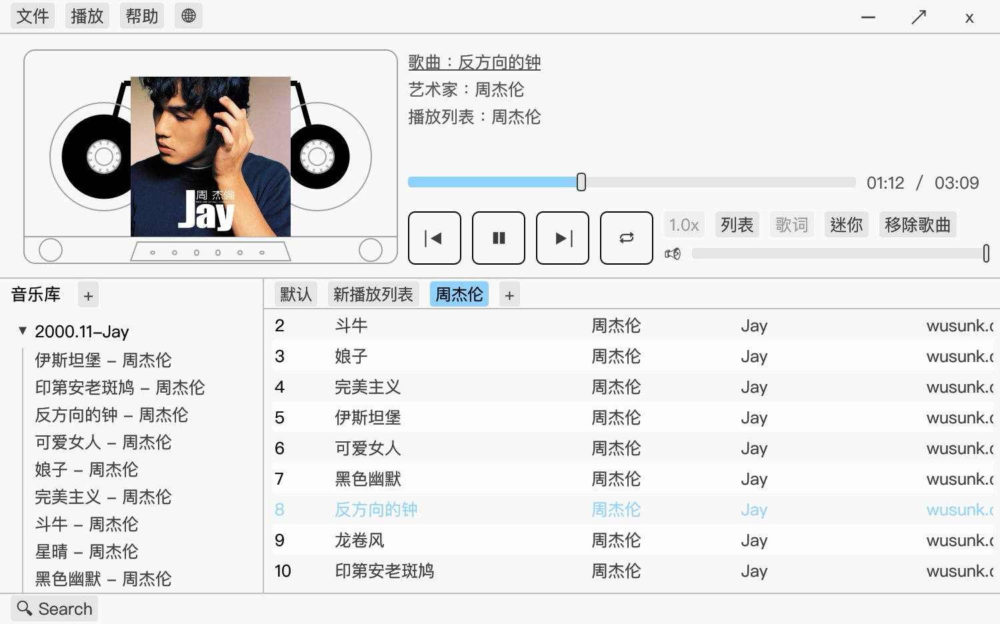
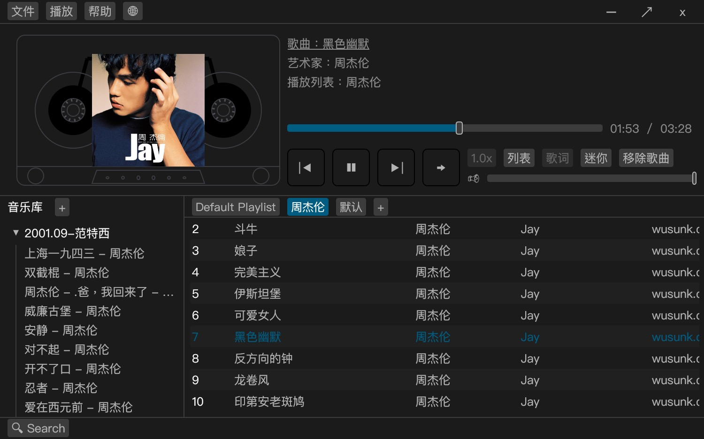

# Bird Player

A MP3 music player built with [egui](https://github.com/emilk/egui) and Rust, featuring a nostalgic 2000s-inspired interface. Bird Player is originally forked from [music-player](https://github.com/notryanb/music-player) by [notryanb](https://github.com/notryanb) and try to make it a serious daily-used music player. If you miss the golden era of desktop music players, this might be for you!

<div style="display: flex; width: 100%;">
    
    
</div>

> [!NOTE]
> Development builds use an isolated `bird-player-dev` data directory. Production
> packages must enable the `production-data` feature explicitly.

## Features

- 🎨 Retro-inspired UI built with egui, reminiscent of classic 2000s music players
- 📁 Local music library and playlist management with familiar browsing experience
- 🏷️ ID3 tag management and editing support for music metadata
- 📱 Cross-platform support

## TODO

- [ ] Improve the resource usage and make it small and fast
- [ ] Add support for more audio formats and use `https://docs.rs/lofty/latest/lofty/` to manage metadata
- [ ] Add support for batch tag editing
- [x] Add support for lyrics searching and displaying
- [ ] Add support for speed control
- [ ] Implement a skin system

## Installation

### Prerequisites

- Rust 1.85 or higher
- Cargo package manager
- Audio system libraries (see [Audio Backends](/docs/AUDIO_BACKENDS.md) below)

### Building from Source

1. Clone the repository:
```bash
git clone https://github.com/yourusername/bird-player.git
cd bird-player
```

2. Build the project:
```bash
# With PulseAudio support (recommended for Linux)
cargo build --release --features pulseaudio

# Without PulseAudio (using CPAL directly)
cargo build --release
```

The compiled binary will be available in `target/release/bird-player`.

### macOS App Bundle

Build a macOS `.app` bundle with:

```bash
cargo bundle --release --features production-data
```

The bundle is written to `target/release/bundle/osx/Bird Player.app`. To install it locally, copy it to `/Applications`.

When the app is launched from Finder, Dock, or LaunchServices, it does not inherit the interactive shell `PATH`. Any bundled build that calls user-installed command line tools must set a runtime `PATH` explicitly. Bird Player currently does this for `yt-dlp` by adding common user binary directories such as `~/.local/bin`, `~/bin`, `/opt/homebrew/bin`, and `/usr/local/bin` before spawning the command. Keep this in mind when adding future external tools, otherwise a tool that works in Terminal may fail inside the packaged app with "not found".

For a local upgrade, use the safe installer:

```bash
./install_mac_app.sh
```

It builds with production data enabled, closes the running app, verifies and
backs up the SQLite database, preserves the old app bundle, installs the new
bundle, and verifies the database again after launch. Old app bundles use the
non-launchable `.app.backup` suffix so they cannot accidentally open the
production database.

Plain `cargo run` and `cargo run --release` intentionally use the isolated
development database. This prevents local UI testing from modifying the
installed app's music library and playlists.

At startup, Bird Player creates and integrity-checks a SQLite snapshot in the
profile's `backups` directory, retaining the 10 newest snapshots. A build that
encounters an unknown or newer database schema stops with a visible warning;
it never drops or rebuilds existing user tables.

## Usage

1. Launch Bird Player:
```bash
cargo run --release
```

2. Use the file dialog to add your music directory
3. Browse and play your music collection
4. Enjoy your music with high-quality audio playback

## License

[MIT](LICENSE)

## Contributing

Contributions are welcome! Please feel free to submit a Pull Request.

## Acknowledgments

The project is originally forked from [music-player](https://github.com/notryanb/music-player) by [notryanb](https://github.com/notryanb). Thanks to all the Rust crate authors whose work made this project possible.
